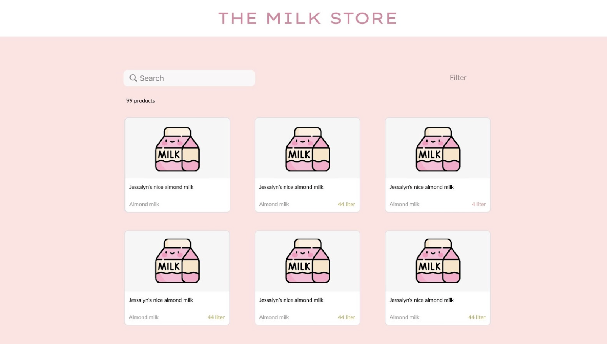

# The Milk Store

## Scenario
A small local milk shop needs help desperately. Lately they started getting a lot of business, and they feel that they need a proper website to take a load off their store. The milk sold through this store is by the liter and there are several different types of milk to choose from. The task is to create an application which retrieves and displays mock data from an api that the user can be easily navigate through and place a mock order.

# Requirements
The milk data is fetched from the following api: https://github.com/saltstudy/pgp-test-milkApp-json
1. As the customer enters the site they should be met with all the cards of milk that are in storage.
2. A search bar where they can search based on name.
3 .A filter function that can filter out different types of milk; whole milk, oat milk, pea milk, almond milk, rice milk, coconut milk, soy milk, walnut milk, macadamia milk, hemp milk, cashew milk.
4. The customer should be able to click on a card and be redirected to the product.
5. Information to be displayed
  - A slider, or an number input, to choose how many liters to order.
  - An order button that, when clicked, should clearly display that the order is completed.
  - Pagination, show 9 cards per page.

# Tech Stack
React JS
Typescript
Bootstrap
Sass
Node JS
Vite

# Getting Started
1. First, run the backend server:
cd server
npm i
npm start
API routes can be accessed on http://localhost:8080/api/milkstore. This endpoint can be edited in server/app.ts.

2. First, run the frontend development server:
cd client
npm i
npm run dev
Open http://127.0.0.1:5173/ with your browser to see the result.

# Author
Robert Bish

